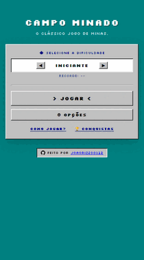

# Minesweeper Classic 98

Uma recriação moderna do clássico **Campo Minado**, inspirada na interface e na experiência do Windows 98.

O projeto mantém a jogabilidade tradicional do Campo Minado e adiciona sistemas próprios de geração de tabuleiros, resolução lógica, diferentes modos de jogo, conquistas, recordes, tutorial interativo e suporte a Progressive Web App.



---

## Sobre o projeto

O **Minesweeper Classic 98** foi desenvolvido para recriar a experiência do Campo Minado clássico, combinando a estética dos aplicativos do Windows 98 com recursos modernos de desenvolvimento web.

A interface utiliza elementos visuais inspirados no sistema operacional clássico, incluindo bordas em relevo, botões tridimensionais, display LCD, tipografia pixelada e animações.

Além da experiência tradicional, o projeto possui sistemas adicionais para aumentar a variedade e a profundidade das partidas.

A aplicação funciona diretamente no navegador e não necessita de frameworks, dependências ou processo de build.

Também é possível instalar o jogo como um aplicativo através de Progressive Web App.

---

## Funcionalidades

### Jogabilidade

O jogo mantém as principais regras do Campo Minado clássico:

* Revelação de células
* Identificação de minas através dos números
* Sistema de bandeiras
* Marcação de células com `?`
* Chord Click
* Auto-flag através de duplo clique
* Contador de minas
* Cronômetro
* Detecção automática de vitória
* Sistema de derrota
* Reinício das partidas
* Controles adaptados para dispositivos móveis

---

## Dificuldades

O jogo possui cinco níveis de dificuldade predefinidos, começando em uma configuração introdutória e chegando ao modo **Extraterrestre**.

Também existe um sistema de dificuldade personalizada.

O jogador pode definir:

* Largura do tabuleiro
* Altura do tabuleiro
* Quantidade de minas

Isso permite criar partidas com configurações diferentes das dificuldades predefinidas.

---

## Geração de tabuleiros

O projeto possui três métodos diferentes para geração dos tabuleiros.

### Aleatório

Distribui as minas de maneira aleatória pelo tabuleiro.

É o comportamento mais próximo de uma partida tradicional.

### Início seguro

Considera o primeiro movimento do jogador durante a geração da partida.

O objetivo é evitar que a primeira jogada resulte imediatamente em uma situação desfavorável.

### Pura lógica

Utiliza um sistema de resolução integrado para analisar e validar os tabuleiros gerados.

O objetivo é criar partidas que possam ser solucionadas através de dedução lógica, reduzindo situações em que o jogador precisa depender exclusivamente de tentativa e erro.

---

## Solver

O projeto possui um solver próprio para análise de tabuleiros de Campo Minado.

O sistema analisa as relações entre:

* Células reveladas
* Números
* Células ocultas
* Minas conhecidas
* Possíveis posições de minas

A partir dessas informações, o algoritmo consegue analisar possibilidades e determinar movimentos seguros em determinadas situações.

O solver também é utilizado pelo modo de geração baseado em lógica para validar os tabuleiros.

---

## Modo Desarmamento

O **Modo Desarmamento** adiciona uma regra alternativa ao jogo tradicional.

Nesse modo, o jogador pode sobreviver à primeira mina acionada e continuar a partida.

O objetivo é oferecer uma experiência mais tolerante sem remover completamente o desafio do Campo Minado.

---

## Sistema de dicas

O jogo possui um sistema de dicas para auxiliar o jogador durante uma partida.

Ao utilizar uma dica, o sistema revela uma célula segura.

Como consequência, o jogador recebe uma penalidade no tempo da partida.

Dessa forma, a dica pode ser utilizada como ferramenta de auxílio sem eliminar completamente o desafio.

---

## Tutorial interativo

O projeto possui um tutorial jogável baseado em um pequeno tabuleiro de **5×5**.

Em vez de apenas apresentar instruções, o tutorial ensina as mecânicas através da interação direta com o tabuleiro.

O jogador aprende conceitos como:

* Revelação de células
* Identificação de minas
* Interpretação dos números
* Utilização de bandeiras
* Dedução lógica
* Condições de vitória

---

## Sistema de conquistas

O jogo possui **26 conquistas** desbloqueáveis.

O sistema conta com:

* Detecção automática de conquistas
* Notificações durante a partida
* Tela dedicada para acompanhamento
* Persistência do progresso
* Diferentes objetivos e condições de desbloqueio

As notificações foram inspiradas em sistemas de conquistas encontrados em plataformas modernas de jogos.

---

## Recordes

Os melhores tempos são armazenados individualmente de acordo com a dificuldade.

O progresso é salvo localmente no navegador.

Entre os dados armazenados estão:

* Melhores tempos
* Conquistas desbloqueadas
* Progresso do jogador
* Configurações persistentes

O sistema utiliza `LocalStorage` para manter essas informações entre sessões.

---

## Interface inspirada no Windows 98

A interface foi criada com forte inspiração no visual clássico do Windows 98.

Entre os principais elementos estão:

* Bordas tridimensionais
* Efeito de relevo
* Botões clássicos
* Display LCD vermelho
* Tipografia pixelada
* Paleta de cores retrô
* Carinha de status
* Elementos de interface inspirados no Minesweeper original

O objetivo é reproduzir a identidade visual clássica sem comprometer a utilização em dispositivos modernos.

---

## Efeitos visuais

O jogo possui diferentes efeitos para eventos importantes.

### Vitória

Ao concluir uma partida, são exibidos efeitos de celebração e confetes.

### Derrota

Quando uma mina é acionada, o jogo apresenta uma sequência de efeitos, incluindo:

* Tremor da tela
* Explosão da mina
* Explosões em sequência
* Revelação das minas restantes
* Animações das células

---

## Progressive Web App

O **Minesweeper Classic 98** possui suporte a Progressive Web App.

Isso permite instalar o jogo como um aplicativo em dispositivos compatíveis.

O projeto utiliza:

* Web App Manifest
* Service Worker
* Cache offline
* Ícones do aplicativo
* Interface responsiva
* Modo de instalação como aplicativo

O jogo pode ser instalado em plataformas compatíveis, incluindo:

* Windows
* Android
* iOS
* Navegadores modernos

---

## Responsividade

A interface foi desenvolvida para diferentes tamanhos de tela.

O layout se adapta para:

* Computadores
* Notebooks
* Tablets
* Smartphones

Os controles e elementos da interface são ajustados de acordo com o espaço disponível.

O projeto também possui um fundo animado inspirado no próprio tabuleiro do Campo Minado.

---

## Organização da aplicação

Por decisão de arquitetura, a interface, os estilos e a lógica principal do jogo foram mantidos em um único arquivo `index.html`.

A escolha foi feita para manter o projeto simples de distribuir e executar, permitindo que o jogo seja hospedado ou executado sem configuração adicional, dependências ou processo de build.

Essa abordagem também facilita a portabilidade do projeto, já que a aplicação principal pode ser transferida e executada como uma unidade, mantendo HTML, CSS e JavaScript diretamente relacionados à interface e à lógica do jogo.

Os arquivos externos são utilizados apenas para recursos que possuem uma finalidade específica, como a configuração do Progressive Web App, o Service Worker e os ícones da aplicação.

### Estrutura

```text
Minesweeper-Classic-98/
│
├── index.html
│   ├── HTML
│   ├── CSS
│   └── JavaScript
│
├── manifest.json
│   └── Configuração do PWA
│
├── sw.js
│   └── Service Worker
│
├── icons/
│   └── Ícones da aplicação
│
├── demo.gif
│   └── Demonstração
│
└── README.md
    └── Documentação do projeto
```

A separação tradicional entre `HTML`, `CSS` e `JavaScript` seria uma alternativa válida para um projeto de maior escala. Neste caso, a estrutura em arquivo único foi uma escolha deliberada para priorizar portabilidade, facilidade de execução e distribuição.

---

## Tecnologias

O projeto utiliza tecnologias web nativas.

| Tecnologia       | Utilização                            |
| ---------------- | ------------------------------------- |
| HTML5            | Estrutura da aplicação                |
| CSS3             | Interface, responsividade e animações |
| JavaScript       | Lógica do jogo e sistemas             |
| LocalStorage     | Persistência dos dados                |
| Web App Manifest | Configuração do PWA                   |
| Service Worker   | Cache e funcionamento offline         |

Não é necessário instalar frameworks ou bibliotecas para executar o projeto.

---

## Destaques técnicos

O projeto explora conceitos além da implementação básica de um jogo de Campo Minado.

* Geração procedural de tabuleiros
* Distribuição aleatória de minas
* Validação de tabuleiros
* Algoritmos de resolução
* Análise de restrições
* Geração baseada em lógica
* Gerenciamento de estados
* Sistema de dificuldades
* Geração de partidas personalizadas
* Sistema de conquistas
* Sistema de recordes
* Persistência de dados
* Sistema de dicas
* Animações CSS
* Eventos JavaScript
* Interface responsiva
* Progressive Web App
* Cache offline

---

## Executando localmente

O projeto não possui dependências externas obrigatórias e não necessita de processo de build.

Clone o repositório:

```bash
git clone https://github.com/joaorizzo0112/Minesweeper-Classic-98.git
```

Entre na pasta:

```bash
cd Minesweeper-Classic-98
```

Inicie um servidor HTTP local.

Utilizando Python:

```bash
python3 -m http.server 8000
```

Depois abra:

```text
http://localhost:8000
```

Também é possível utilizar qualquer outro servidor HTTP estático.

É recomendado utilizar um servidor local para testar corretamente recursos como Service Worker e Progressive Web App.

---

## Versão online

O jogo está disponível diretamente no navegador:

**https://joaorizzo0112.github.io/campo-minado/**

Não é necessário instalar nada para jogar a versão web.

---

## Objetivos do projeto

O projeto foi desenvolvido como uma combinação entre um jogo completo e um estudo prático de desenvolvimento web.

Durante o desenvolvimento foram explorados conceitos como:

* Algoritmos
* Lógica de programação
* Geração procedural
* Resolução de problemas
* Gerenciamento de estados
* Armazenamento local
* Desenvolvimento de interfaces
* Responsividade
* Animações
* Progressive Web Apps
* Funcionamento offline

A escolha por tecnologias web nativas também mantém o projeto leve, simples de executar e fácil de estudar.

---

## Autor **joaorizzo0112**

GitHub: https://github.com/joaorizzo0112

---

## Licença

Consulte o arquivo `LICENSE` do repositório para obter informações sobre os termos de utilização e distribuição do projeto.
